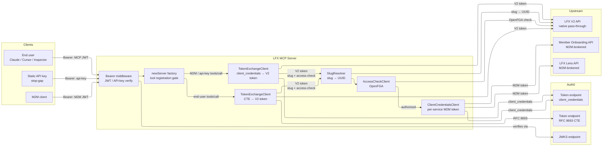
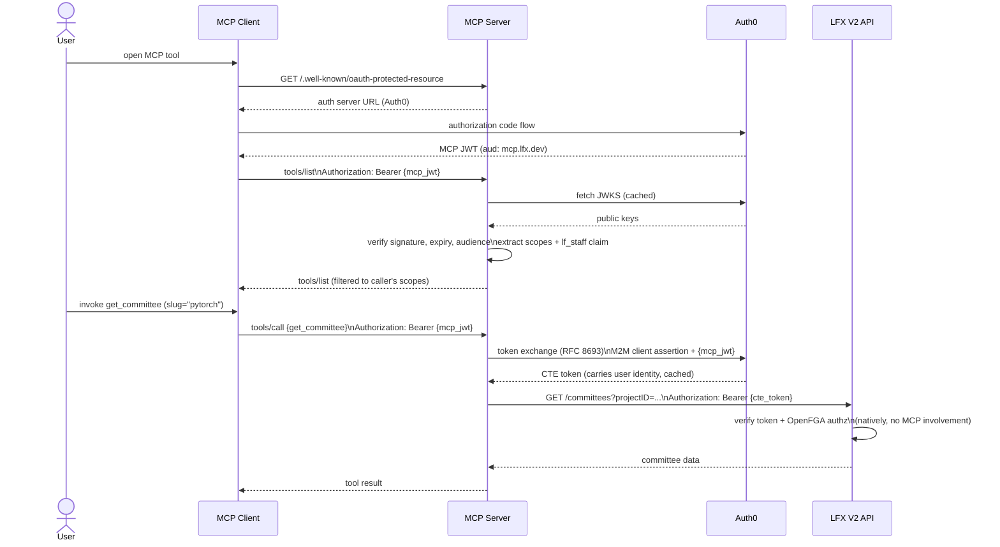
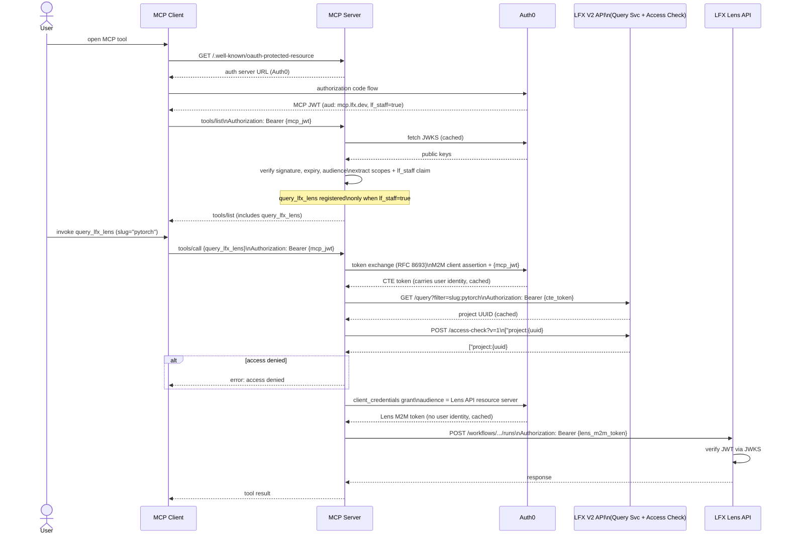
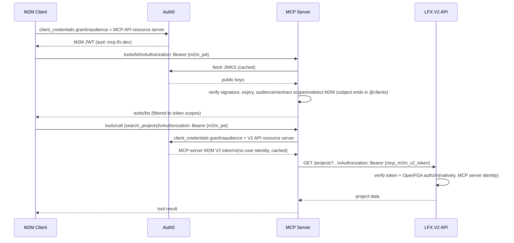
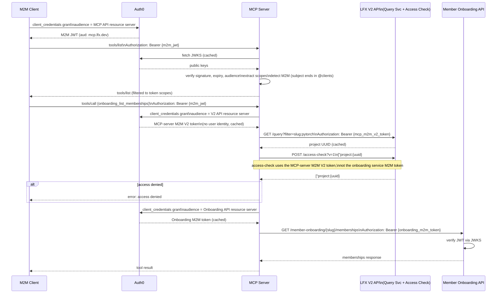

# LFX MCP Server — Architecture

> **Current state** as of April 2026.

The LFX MCP Server is a [Model Context Protocol](https://modelcontextprotocol.io/) server that
exposes LFX platform capabilities as MCP tools. It supports two transport modes:

- **stdio** — for local development; the binary reads/writes JSON-RPC 2.0 messages on
  stdin/stdout with no authentication required.
- **HTTP (Streamable HTTP)** — for production Kubernetes deployments; the `/mcp` endpoint
  accepts JSON-RPC 2.0 over HTTP with OAuth2 bearer token authentication.

---

## 1. Client Authentication & Authorization

All inbound calls in HTTP mode pass through a bearer-token middleware before reaching the MCP
protocol layer. The middleware produces a `TokenInfo` struct (scopes + custom claims) that drives
tool registration: `newServer()` is called once per HTTP request and registers only the tools the
caller is permitted to invoke, so `tools/list` always reflects exactly what the caller can use.

### Stateless HTTP and per-request tool gating

The `StreamableHTTPHandler` runs with `Stateless: true`:

- Each HTTP request gets a fresh `*mcp.Server` from the `newServer()` factory — no MCP-level
  session state accumulates across requests.
- Any pod can handle any request; round-robin load balancing works without Kubernetes session
  affinity.
- A package-level `schemaCache` is shared across per-request server instances so that
  reflection-based JSON schema generation runs once per tool type rather than once per request.
- Client callbacks (`ListRoots`, `CreateMessage`, `Elicit`) are not available in stateless mode
  and are not used.

Tool registration is gated on two boolean values derived from `TokenInfo` at server creation time:

| Flag | Condition | Grants access to |
|---|---|---|
| `canRead` | token holds `read:all` **or** `manage:all` | All read-only tools |
| `canManage` | token holds `manage:all` | Read + write/delete tools |

An additional `isStaff` flag (derived from the `http://lfx.dev/claims/lf_staff` custom claim)
gates the `query_lfx_lens` tool independently of scopes.

### End-user OAuth2 JWT

The primary authentication path. The user completes an Auth0 authorization code flow in their
MCP client (Claude, Cursor, Inspector, etc.) and receives an MCP JWT. The server verifies the
token signature via JWKS (cached), checks the audience, and extracts scopes and custom claims.

MCP clients that implement [OAuth 2.0 Protected Resource Metadata (RFC 9728)](https://www.rfc-editor.org/rfc/rfc9728)
first fetch `/.well-known/oauth-protected-resource` from the MCP server to discover the Auth0
authorization server URL before starting the OAuth flow.

### M2M client credentials

A machine caller obtains a bearer token from Auth0 via the client credentials grant and presents
it as a standard bearer token. The server follows the same JWT verification path as for end-user
tokens; the scopes embedded in the M2M JWT determine which tools are registered.

### Static API key (stop-gap)

For MCP clients that cannot complete an OAuth2 flow, static API keys can be configured via
`LFXMCP_API_CREDENTIALS_<KEY>=<secret>` environment variables. The `APIKeyVerifier` is checked
before the JWT path; when a key matches it synthesizes a `TokenInfo` with a fixed scope set so
the rest of the tool-gating logic is identical to the JWT path.

> **This mechanism is a temporary stop-gap and will be retired once all consumers support OAuth2.**

---

## 2. Upstream Authentication & Authorization

Once a tool handler is invoked, the server authenticates to one or more upstream LFX APIs. There
are two distinct patterns depending on whether the upstream API supports per-user authorization
natively.

### Custom Token Exchange (CTE) — end-user callers

For end-user callers, the server exchanges the user's MCP JWT for a V2-scoped token that carries
the user's identity. This is a **Custom Token Exchange** per
[RFC 8693](https://www.rfc-editor.org/rfc/rfc8693): the MCP server's own M2M client
(`LFX MCP Server`) authenticates to Auth0 using a signed JWT client assertion (RS256, RFC 7523)
or client secret, and presents the user's MCP JWT as the `subject_token`. Auth0 issues a
V2-scoped token that carries the user's identity. The exchanged token is cached per user subject
and refreshed automatically on expiry.

### MCP-server M2M V2 token — M2M and API-key callers

When the inbound bearer is itself an M2M JWT (Auth0 subjects for M2M tokens end in `@clients`)
or a static API key, there is no user identity to exchange. In this case the server obtains a
V2-scoped token via a standard client credentials grant using the same M2M client — no CTE is
performed. The upstream V2 identity is always the MCP server itself; no user identity is present
in the chain. This token is also cached and shared across all M2M and API-key requests.

### Native LFX self-service pass-through

V2 API tools (`search_projects`, `get_committee`, member, meeting, mailing list tools, etc.) pass
the V2 token (CTE token for end-user callers; MCP-server M2M V2 token for M2M callers) directly
to V2 API calls. Authorization is handled natively by V2 and its OpenFGA backend; the MCP server
performs no explicit access-check of its own for these tools.

### MCP-brokered service APIs (OpenFGA gate + per-service M2M token)

Service APIs (LFX Lens and Member Onboarding) accept only M2M tokens — they have no per-user
authorization layer. The MCP server acts as the authorization gateway:

1. Obtain the appropriate V2 token: CTE token (end-user) or MCP-server M2M V2 token (M2M /
   API-key caller).
2. Resolve the project slug → UUID via the V2 Query Service, authorized with the V2 token from
   step 1.
3. Call the V2 access-check endpoint (`POST /access-check?v=1`, backed by OpenFGA), authorized
   with the same V2 token from step 1 — **not** the service-API M2M token. The check format is
   `project:{uuid}#auditor` for LFX Lens and `project:{uuid}#writer` for Member Onboarding.
4. Acquire a separate per-service M2M token via a standard client credentials grant (same M2M
   client, different `audience`). Each service has its own `ClientCredentialsClient` that caches
   the token and refreshes it automatically.
5. Call the service API with the per-service M2M token. The service only ever sees that M2M
   token — no user identity is forwarded.

LFX Lens additionally requires the `lf_staff` claim in the caller's MCP JWT (checked at tool
registration time; the tool is simply not registered for non-staff callers).

The access-check result format uses `#` for the relation and tab-separates the echoed request
from the boolean result. Multiple checks can be batched; results are not guaranteed to be in
request order and are matched by parsing the request prefix from each result string.

---

## 3. End-to-End Flows

### Flow 1: End-user → V2 native pass-through

Representative tool: `get_committee`

### Flow 2: End-user → MCP-brokered service API

Representative tool: `query_lfx_lens`

### Flow 3: M2M client → V2 native pass-through

Representative tool: `search_projects`

### Flow 4: M2M client → MCP-brokered service API

Representative tool: `onboarding_list_memberships`

