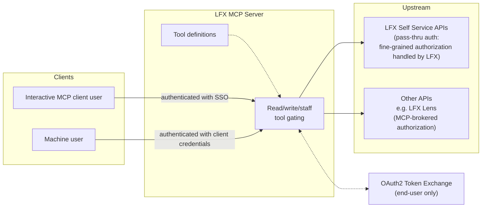
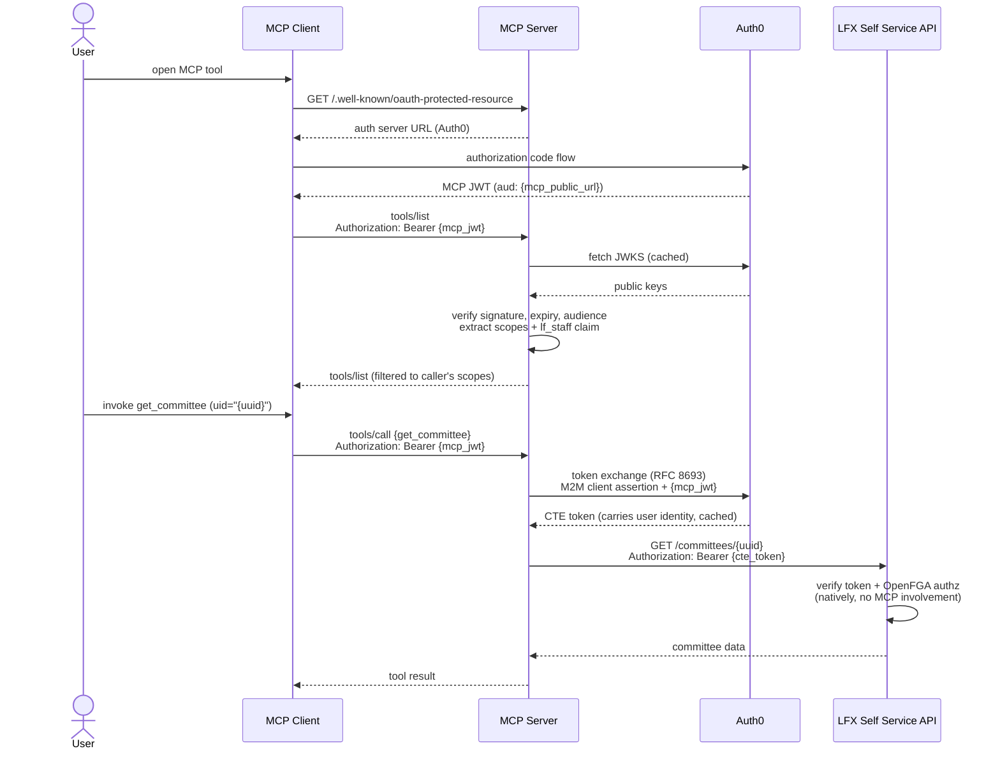
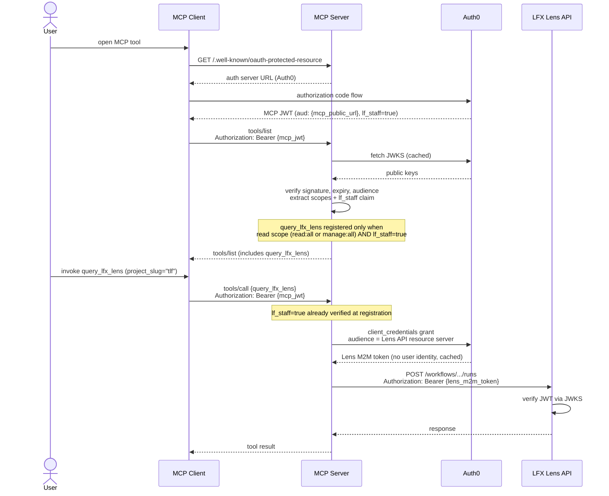
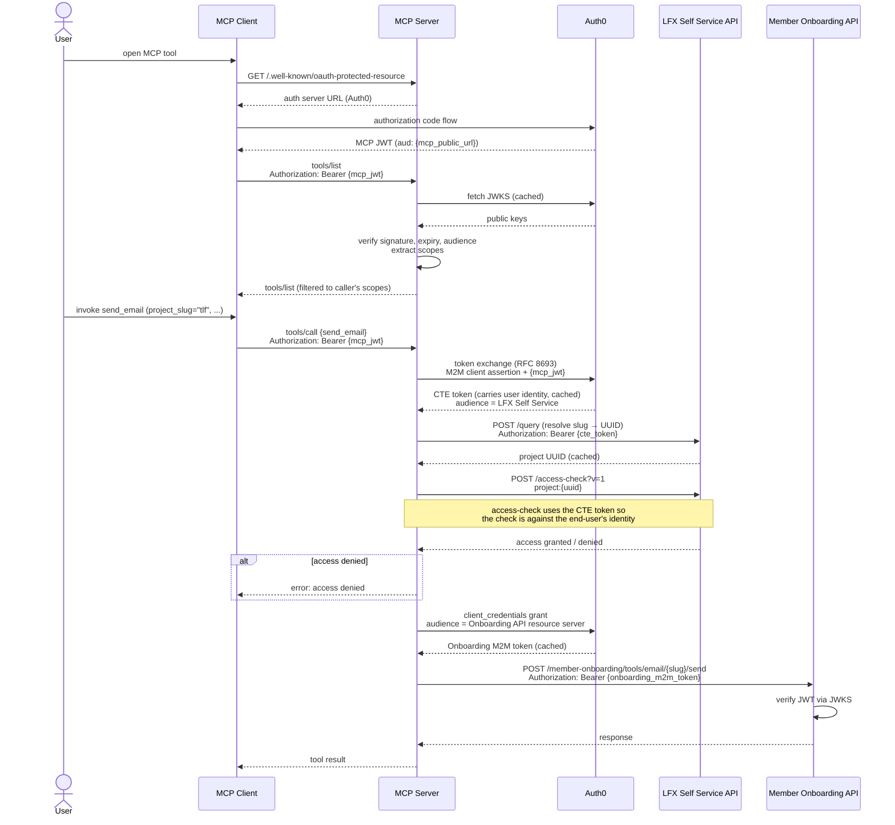
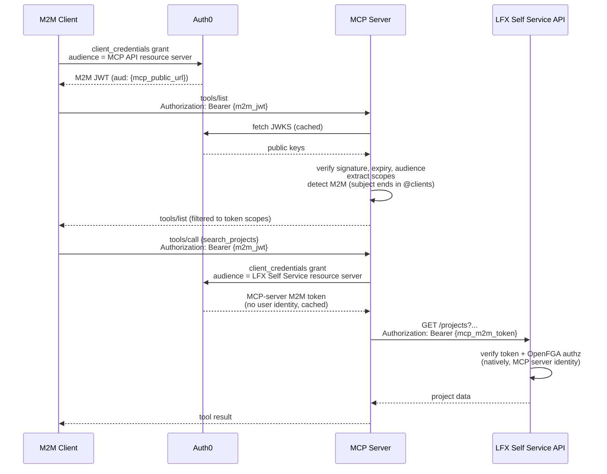
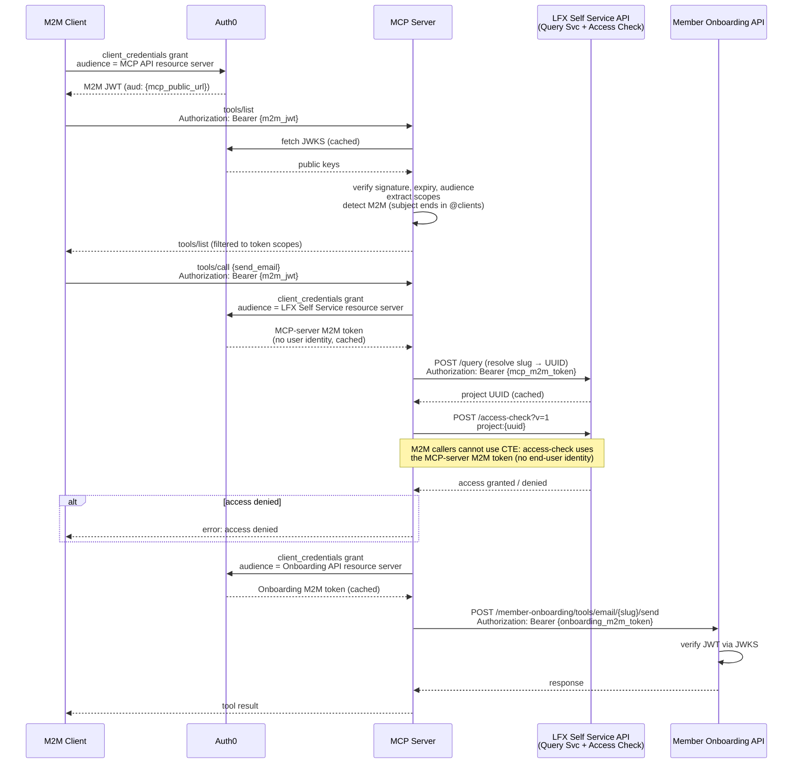

# LFX MCP Server — Architecture

The LFX MCP Server is a [Model Context Protocol](https://modelcontextprotocol.io/) server that
exposes LFX platform capabilities as MCP tools. It supports two transport modes:

- **stdio** — for local development; the binary reads/writes JSON-RPC 2.0 messages on
  stdin/stdout with no authentication required.
- **HTTP (Streamable HTTP)** — for production Kubernetes deployments; the `/mcp` endpoint
  accepts JSON-RPC 2.0 over HTTP with OAuth2 bearer token authentication.

---

## 1. Client Authentication & Authorization

All inbound calls in HTTP mode pass through a bearer-token middleware before reaching the MCP
protocol layer. The middleware extracts scopes and custom claims from the token, which drive
tool registration: only the tools the caller is permitted to invoke are registered for that
request, so `tools/list` always reflects exactly what the caller can use.

### Stateless HTTP and per-request tool gating

The HTTP server is fully stateless — each request is handled independently, with no session
affinity required. Any pod can handle any request, so round-robin load balancing works without
Kubernetes session affinity.

Tool registration is gated on two access levels derived from the caller's token:

| Level | Condition | Grants access to |
|---|---|---|
| Read | token holds `read:all` **or** `manage:all` | All read-only tools |
| Manage | token holds `manage:all` | Read + write/delete tools |

An additional requirement of the `lf_staff` claim (from the `http://lfx.dev/claims/lf_staff`
custom claim) gates the `query_lfx_lens` tool on top of the read scope requirement.

### End-user OAuth2 JWT

The primary authentication path. The user completes an Auth0 authorization code flow in their
MCP client (Claude, Cursor, Inspector, etc.) and receives an MCP JWT. The server verifies the
token signature via JWKS (cached), checks the audience, and extracts scopes and custom claims.

MCP clients that implement [OAuth 2.0 Protected Resource Metadata (RFC 9728)](https://www.rfc-editor.org/rfc/rfc9728)
first fetch `/.well-known/oauth-protected-resource` from the MCP server to discover the Auth0
authorization server URL before starting the OAuth flow.

### M2M client credentials

A machine caller obtains a bearer token from Auth0 via the client credentials grant and presents
it as a standard bearer token. The server follows the same JWT verification path as for end-user
tokens; the scopes embedded in the M2M JWT determine which tools are registered.

### Static API key (stop-gap)

For MCP clients that cannot complete an OAuth2 flow, static API keys can be configured via
`LFXMCP_API_CREDENTIALS_<KEY>=<secret>` environment variables. A matching key is granted
`read:all` and `manage:all` scopes — the same as a fully-privileged M2M token — so it
participates in the same scope-based tool-gating logic. These scopes are hardcoded and not
configurable per key.

> **This mechanism is a temporary stop-gap and will be retired once all consumers support OAuth2.**

---

## 2. Upstream Authentication & Authorization

Once a tool handler is invoked, the server authenticates to one or more upstream LFX APIs. There
are two distinct patterns depending on whether the upstream API supports per-user authorization
natively.

### Custom Token Exchange (CTE) — end-user callers

For end-user callers, the server exchanges the user's MCP JWT for an LFX Self Service token that
carries the user's identity. This is a **Custom Token Exchange** per
[RFC 8693](https://www.rfc-editor.org/rfc/rfc8693): the MCP server's own M2M client
(`LFX MCP Server`) authenticates to Auth0 using a signed JWT client assertion (RS256, RFC 7523)
or client secret, and presents the user's MCP JWT as the `subject_token`. Auth0 issues an
LFX Self Service token that carries the user's identity. The exchanged token is cached by
inbound bearer token and refreshed automatically on expiry.

### MCP-server M2M token — M2M and API-key callers

When the inbound bearer is itself an M2M JWT (Auth0 subjects for M2M tokens end in `@clients`)
or a static API key, there is no user identity to exchange. In this case the server obtains an
LFX Self Service token via a standard client credentials grant using the same M2M client — no
CTE is performed. The upstream identity is always the MCP server itself; no user identity is
present in the chain. This token is also cached and shared across all M2M and API-key requests.

### Native LFX Self Service pass-through

LFX Self Service tools (`search_projects`, `get_committee`, member, meeting, mailing list tools,
etc.) pass the LFX token (CTE token for end-user callers; MCP-server M2M token for M2M callers)
directly to LFX API calls. Authorization is handled natively by LFX and its OpenFGA backend; the
MCP server performs no explicit access-check of its own for these tools.

### MCP-brokered service APIs (per-service M2M token)

Service APIs (LFX Lens and Member Onboarding) accept only M2M tokens — they have no per-user
authorization layer. The MCP server acts as the authorization gateway, with different access
control mechanisms per service:

**LFX Lens** — access requires read scope (`read:all` or `manage:all`) plus the `lf_staff` claim
in the caller's MCP JWT. The tool is not registered for callers missing either requirement, so no
runtime access-check is performed. Because Auth0 only injects the `lf_staff` claim into tokens
issued via the authorization code flow (end-user logins), M2M and API-key callers never receive
this claim and therefore cannot access LFX Lens tools today. This is a known limitation — the
intended behavior for M2M access has not yet been defined.

**Member Onboarding** — access is gated by an OpenFGA check against the LFX Self Service
access-check endpoint:

1. Obtain the appropriate LFX token: CTE token (end-user) or MCP-server M2M token (M2M /
   API-key caller).
2. Resolve the project slug → UUID via the LFX Query Service, authorized with the LFX token from
   step 1.
3. Call the LFX access-check endpoint (`POST /access-check?v=1`, backed by OpenFGA), authorized
   with the same LFX token from step 1 — **not** the service-API M2M token. The check relation is
   `project:{uuid}#writer`.
4. Acquire a separate per-service M2M token via a standard client credentials grant (same M2M
   client, different `audience`). Each service token is cached and refreshed automatically.
5. Call the service API with the per-service M2M token. The service only ever sees that M2M
   token — no user identity is forwarded.

---

## 3. End-to-End Flows

### Flow 1: End-user → LFX Self Service native pass-through

Representative tool: `get_committee`

### Flow 2: End-user → LFX Lens (staff-gated, no access-check)

Representative tool: `query_lfx_lens`

### Flow 3: End-user → MCP-brokered service API (with CTE + access-check)

Representative tool: `send_email`

### Flow 4: M2M client → LFX Self Service native pass-through

Representative tool: `search_projects`

### Flow 5: M2M client → MCP-brokered service API

Representative tool: `send_email`

