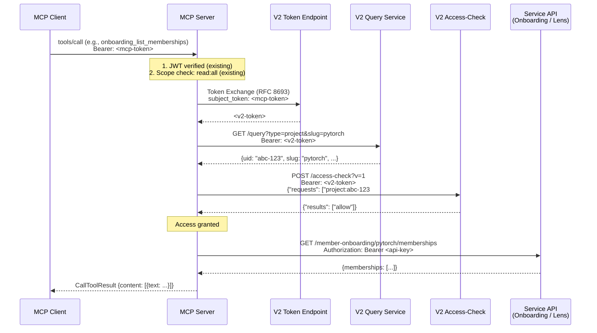
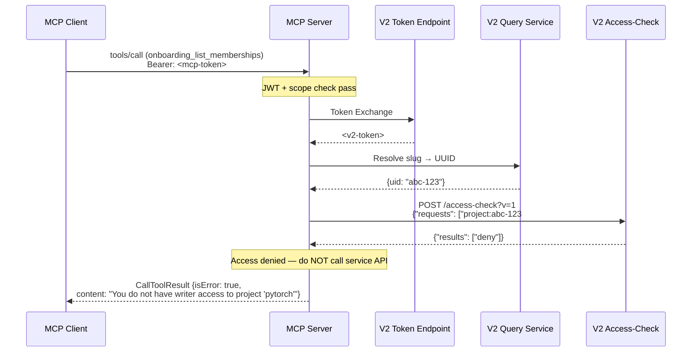
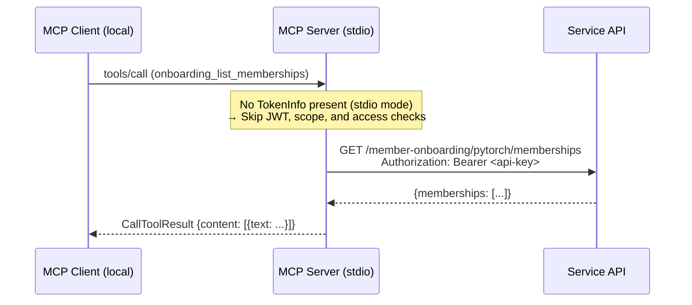
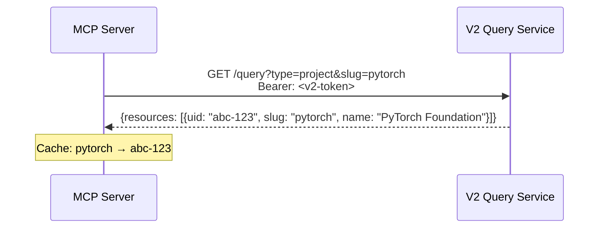

# Service API Authorization Architecture

> **Status:** Proposal — Pending Review
> **Date:** 2026-03-18
> **Reviewers:** Eric Searcy
> **Authors:** Joan Reyero, Josep Reyero

## 1. Context & Problem

The LFX MCP Server currently exposes **LFX V2 API tools** (projects, committees, meetings, mailing lists, members). These tools authenticate by exchanging the user's MCP token for a V2 API token via OAuth2 token exchange (RFC 8693). Authorization is handled by the V2 API itself — Heimdal evaluates each request against OpenFGA relationship tuples.

We now need to expose two new classes of tools through the MCP:

| Service | Backend Auth | Per-User AuthZ |
|---------|-------------|----------------|
| **Member Onboarding** | API key (`OS_SECURITY_KEY`) | None — trusted caller model |
| **LFX Lens** | API key | None — trusted caller model |

These are **internal service APIs** with backend-to-backend authentication. They have no concept of per-user authorization — any caller with the API key has full access. This means the **MCP server must become the authorization gateway**, enforcing per-user, per-project access before proxying requests.

### Requirements

1. **Project-level access control** — a user can only use tools for projects they have the right relationship to.
2. **Dynamic permissions** — changing a user's access should not require token reissuance or redeployment. Permissions come from the live V2 permission store (OpenFGA).
3. **Service APIs unchanged** — the downstream services keep their API-key auth; the MCP acts as a trusted intermediary.
4. **Consistent patterns** — the authorization mechanism should be reusable across any future service API integrations.

---

## 2. Architecture Overview

We use **Option 4** from the design evaluation: the MCP server acts as an authorization gateway, calling the LFX V2 **access-check endpoint** to verify permissions before proxying requests to service APIs.

```
User (JWT via SSO)
  │
  ▼
MCP Server (Go)
  ├─ 1. Verify JWT signature & expiry              (existing)
  ├─ 2. Enforce MCP scope (read:all / manage:all)  (existing)
  ├─ 3. Extract user identity from JWT `sub` claim  (existing)
  ├─ 4. Resolve project slug → V2 UUID             ← NEW
  ├─ 5. Call V2 access-check endpoint               ← NEW
  │     ├─ Denied → return structured error
  │     └─ Allowed ↓
  └─ 6. Call service API with API key               ← NEW
           │
           ▼
     Service API (API-key auth)
```

### What stays the same

- JWT verification, scope enforcement, and token exchange are unchanged.
- Existing V2 API tools (projects, committees, etc.) are unaffected.

### What's new

- **Slug-to-UUID resolution**: translate the project slug (user-facing) to a V2 project UUID (required by access-check).
- **V2 access-check call**: verify the user holds the required relationship (e.g., `writer`) to the project.
- **API-key service client**: proxy the request to the backend service with an API key instead of token exchange.

---

## 3. Sequence Diagrams

### 3.1 Happy Path — Authorized Request



### 3.2 Access Denied



### 3.3 Stdio Mode (Local Development)



---

## 4. Access-Check API Contract

The V2 platform provides a centralized access-check endpoint. Per Eric's clarification, the correct format uses `#` for the relation separator (not `:` as shown in the current auto-generated Swagger docs).

### Request

```http
POST /access-check?v=1 HTTP/1.1
Host: lfx-api.v2.cluster.lfx.dev
Authorization: Bearer <v2-token>
Content-Type: application/json

{
  "requests": [
    "project:{uuid}#writer"
  ]
}
```

### Response (200 OK)

```json
{
  "results": [
    "allow"
  ]
}
```

### Batched Checks

Multiple checks can be submitted in a single request. Results are returned in the same order:

```json
// Request
{
  "requests": [
    "project:abc-123#writer",
    "project:def-456#auditor"
  ]
}

// Response
{
  "results": [
    "allow",
    "deny"
  ]
}
```

### Relation Format

```
{resource_type}:{resource_uuid}#{relation}
```

Examples:
- `project:abc-123#writer` — check if user is a writer on project abc-123
- `project:abc-123#auditor` — check if user is an auditor on project abc-123
- `project:abc-123#owner` — check if user is an owner of project abc-123
- `project:abc-123#viewer` — check if user has viewer access to project abc-123

### Error Responses

| Code | Meaning |
|------|---------|
| 400 | Bad request (malformed check string) |
| 401 | Invalid or expired V2 token |

---

## 5. Slug-to-UUID Resolution

Users interact with projects using **slugs** (e.g., `pytorch`, `cncf`). The access-check endpoint requires **V2 UUIDs**. The MCP server must translate between the two.

### Approach

Per the architecture meeting, the MCP server uses the user's exchanged V2 token to call the **V2 Query Service** (or Project Service), which resolves slugs to UUIDs.



### Caching

Slug-to-UUID mappings are stable (project UUIDs don't change). The MCP server caches them in-memory with a TTL (e.g., 1 hour) to avoid redundant lookups.

### Open Question for Eric

> **Q1:** What is the best V2 endpoint to resolve a project slug to its UUID? Options we see:
> - Query Service: `GET /query?type=project` with a slug filter
> - Project Service: `GET /projects` with a slug parameter
> - A dedicated lookup endpoint
>
> Which do you recommend, and does it accept slug as a query parameter?

---

## 6. Access Rules per Service

### Member Onboarding

| Required Relation | Rationale |
|-------------------|-----------|
| `writer` | Onboarding involves managing member workflows, configuring agents, and modifying rules — these are write-level project operations. Writers and owners (who inherit writer) have this access. |

All onboarding tools (both read and write MCP operations) require the `writer` relation. The distinction between read-only and write MCP tools affects only the **MCP scope** (`read:all` vs `manage:all`), not the V2 access check.

### LFX Lens

| Required Relation | Rationale |
|-------------------|-----------|
| `auditor` | LFX Lens provides analytics and reporting. Auditors have read access to everything including subordinate objects, which matches the data visibility needs. |

All Lens tools require the `auditor` relation. Since Lens is read-only, all tools use the `read:all` MCP scope.

### Role Hierarchy (for reference)

From V2 project role definitions:

| Role | Inherits | Access Level |
|------|----------|-------------|
| **Owner** | — | Highest access, inherits from parent projects |
| **Writer** | — | Can write to most attributes, inherits from parent projects |
| **Auditor** | — | Read access to everything + subordinate objects |
| **Viewer** | Auditor (implicit) | Can see object exists + key properties, no inheritance to subordinates |
| **Meeting Coordinator** | — | Can manage meetings for the project |

A user who is an `owner` of a project also satisfies `writer` checks (transitive relationship in OpenFGA). Similarly, `auditor` implies `viewer`.

---

## 7. Tool Inventory

### 7.1 Member Onboarding Tools

#### Phase 1 — Read-Only Tools

| MCP Tool Name | Backend Endpoint | MCP Scope | V2 Relation | Description |
|---------------|-----------------|-----------|-------------|-------------|
| `onboarding_list_memberships` | `GET /{slug}/memberships` | `read:all` | `writer` | List memberships with agent action/todo counts |
| `onboarding_get_membership` | `GET /{slug}/memberships/{id}` | `read:all` | `writer` | Get full membership detail with per-agent data |
| `onboarding_list_agent_configs` | `GET /{project}/agents/configs` | `read:all` | `writer` | List all agent configurations for a project |
| `onboarding_get_agent_rules` | `GET /{project}/agents/{agent_id}/rules` | `read:all` | `writer` | Get rules for a specific agent |
| `onboarding_list_email_templates` | `GET /{project}/agents/{agent_id}/email-templates` | `read:all` | `writer` | List email templates for an agent |
| `onboarding_get_changes_status` | `GET /{project}/changes-status` | `read:all` | `writer` | Check for unpublished/unsaved changes |
| `onboarding_get_integrations_config` | `GET /integrations-config` | `read:all` | `writer` | Get static agent integration definitions |

#### Phase 2 — Write Tools

| MCP Tool Name | Backend Endpoint | MCP Scope | V2 Relation | Description |
|---------------|-----------------|-----------|-------------|-------------|
| `onboarding_update_agent_config` | `PUT /{project}/agents/{agent_id}/config` | `manage:all` | `writer` | Create or update an agent's configuration |
| `onboarding_delete_agent_config` | `DELETE /{project}/agents/{agent_id}/config` | `manage:all` | `writer` | Delete an agent configuration |
| `onboarding_reorder_agents` | `PUT /{project}/agents/order` | `manage:all` | `writer` | Reorder agents by execution order |
| `onboarding_add_rules` | `POST /{project}/agents/{agent_id}/rules` | `manage:all` | `writer` | Add rules for an agent |
| `onboarding_update_rule` | `PATCH /rules/{rule_id}` | `manage:all` | `writer` | Update a specific rule |
| `onboarding_delete_rule` | `DELETE /rules/{rule_id}` | `manage:all` | `writer` | Delete a rule |
| `onboarding_create_email_template` | `POST /{project}/agents/{agent_id}/email-templates` | `manage:all` | `writer` | Create an email template |
| `onboarding_update_email_template` | `PUT /{project}/agents/{agent_id}/email-templates/{id}` | `manage:all` | `writer` | Update an email template |
| `onboarding_delete_email_template` | `DELETE /{project}/agents/{agent_id}/email-templates/{id}` | `manage:all` | `writer` | Delete an email template |
| `onboarding_save_all` | `POST /{project}/save-all` | `manage:all` | `writer` | Save draft checkpoints for all agents |
| `onboarding_publish_all` | `POST /{project}/publish-all` | `manage:all` | `writer` | Publish all agent configurations |
| `onboarding_revert_all` | `POST /{project}/revert-all` | `manage:all` | `writer` | Revert to last published configuration |
| `onboarding_delete_todo` | `DELETE /todos/{todo_id}` | `manage:all` | `writer` | Delete or complete a todo item |
| `onboarding_replace_todos` | `PUT /{project}/companies/{company}/todos` | `manage:all` | `writer` | Replace all todos for a company/project |
| `onboarding_add_actions` | `POST /{project}/companies/{company}/actions` | `manage:all` | `writer` | Bulk add actions for a company/project |

### 7.2 LFX Lens Tools

> Tool inventory to be defined based on LFX Lens API endpoints. All tools will use the same authorization pattern with `auditor` relation.

| MCP Tool Name | Backend Endpoint | MCP Scope | V2 Relation | Description |
|---------------|-----------------|-----------|-------------|-------------|
| `lfx_lens_query` | TBD | `read:all` | `auditor` | Query LFX Lens analytics for a project |
| *(additional tools TBD)* | | | | |

---

## 8. Service API Client Pattern

Service APIs use API-key authentication instead of token exchange. The MCP server acts as a trusted intermediary.

```
┌─────────────────────────────────────────────────────────┐
│                     MCP Server                          │
│                                                         │
│  ┌─────────────────┐     ┌──────────────────────────┐  │
│  │ Existing V2 Tools│     │ New Service Tools         │  │
│  │ (projects, etc.) │     │ (onboarding, lens)        │  │
│  └────────┬─────────┘     └────────────┬─────────────┘  │
│           │                            │                 │
│           ▼                            ▼                 │
│  ┌─────────────────┐     ┌──────────────────────────┐  │
│  │ Token Exchange   │     │ API-Key Service Client    │  │
│  │ (RFC 8693)       │     │ Authorization: Bearer     │  │
│  │ MCP→V2 token     │     │ <OS_SECURITY_KEY>         │  │
│  └────────┬─────────┘     └────────────┬─────────────┘  │
└───────────┼────────────────────────────┼─────────────────┘
            │                            │
            ▼                            ▼
    ┌───────────────┐          ┌──────────────────┐
    │  LFX V2 APIs  │          │  Service APIs     │
    │  (Heimdal     │          │  (Onboarding,     │
    │   enforces    │          │   Lens — no       │
    │   authZ)      │          │   per-user authZ) │
    └───────────────┘          └──────────────────┘
```

Key differences between the two tool patterns:

| Aspect | V2 API Tools (existing) | Service API Tools (new) |
|--------|------------------------|------------------------|
| Backend auth | Token exchange (user's exchanged token) | API key (shared secret) |
| Backend authZ | Heimdal/OpenFGA (V2 handles it) | None (MCP handles it) |
| AuthZ enforcement | V2 API layer | MCP server (via access-check) |
| When authZ fails | V2 returns 403 | MCP returns IsError before calling backend |

---

## 9. Configuration

### New Environment Variables

| Variable | Description | Required for |
|----------|-------------|-------------|
| `LFXMCP_ONBOARDING_API_URL` | Base URL of the member onboarding service | Onboarding tools |
| `LFXMCP_ONBOARDING_API_KEY` | The `OS_SECURITY_KEY` value for the onboarding service | Onboarding tools |
| `LFXMCP_LENS_API_URL` | Base URL of the LFX Lens service | Lens tools |
| `LFXMCP_LENS_API_KEY` | API key for the LFX Lens service | Lens tools |

### Existing Variables (reused)

| Variable | Used for |
|----------|---------|
| `LFXMCP_LFX_API_URL` | V2 API domain (for access-check and slug resolution) |
| `LFXMCP_TOKEN_ENDPOINT` | Token exchange endpoint (to get V2 tokens) |
| `LFXMCP_CLIENT_ID` | OAuth client ID (for token exchange) |
| `LFXMCP_CLIENT_SECRET` / `LFXMCP_CLIENT_ASSERTION_SIGNING_KEY` | Client auth for token exchange |

### Tool Enablement

Service tools are registered conditionally. If the service URL and API key are not configured, the tools are simply not available. The `LFXMCP_TOOLS` variable can be used to explicitly enable/disable individual tools.

---

## 10. Open Questions for Eric

| # | Question | Context |
|---|----------|---------|
| 1 | **Slug-to-UUID resolution endpoint** — What is the best V2 endpoint to resolve a project slug to its UUID? We see options in the Query Service and Project Service. Does either accept `slug` as a direct query parameter? | The MCP receives slugs from users but needs UUIDs for access-check. |
| 2 | **Access-check relation format** — Can you confirm the exact format is `project:{uuid}#writer` (with `#`)? The Swagger docs show `project:123:read` (with `:`) but you mentioned they're inaccurate. | We want to implement against the correct contract. |
| 3 | **Transitive relations** — When we check `project:{uuid}#writer`, will this return `allow` for users who are `owner` of that project (since owner implies writer)? | We want to avoid checking multiple relations when the hierarchy handles it. |
| 4 | **Access-check batching** — Can we batch multiple checks in a single request (e.g., check both writer and auditor in one call)? The Swagger suggests yes, but want to confirm. | Useful if a single tool call needs multiple permission checks. |
| 5 | **LFX Lens scope** — Is `auditor` the right relation for all Lens operations? Are there any Lens features that should require a higher permission level? | Want to confirm before implementing. |
| 6 | **Staff-only access** — For features that are staff-only (discussed for Lens), is there an existing Auth0 action or claim we should check, or do we need to implement something new? | The meeting discussed handling this via Auth0 action or a new scope. |
