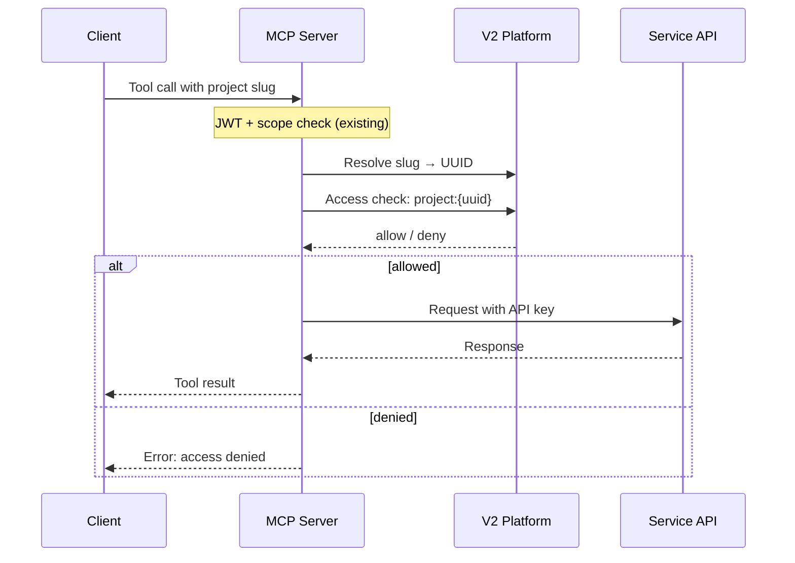

# Service API Authorization Architecture

> **Status:** Proposal — Pending Review
> **Date:** 2026-03-18
> **Reviewers:** Eric Searcy
> **Authors:** Joan Reyero, Josep Reyero

## Context

The LFX MCP Server needs to expose tools for **Member Onboarding** and **LFX Lens**. These are internal service APIs authenticated with a shared API key — they have no per-user authorization.

The MCP server will act as the authorization gateway: before proxying a request to a service API, it calls the **V2 access-check endpoint** to verify the user has the right relationship to the project. This is **Option 4** from our design evaluation.

### Access Rules

| Service | Required V2 Relation | Rationale |
|---------|---------------------|-----------|
| **Member Onboarding** | `writer` | Managing onboarding workflows is a write-level project operation |
| **LFX Lens** | `auditor` | Analytics/reporting requires auditor-level read access |

---

## Authorization Flow

When a user calls a service tool, the MCP server:

1. Verifies JWT and MCP scope (existing, unchanged)
2. Resolves the project slug to a V2 UUID
3. Calls V2 access-check to verify the user's relationship
4. If allowed, proxies the request to the service API with an API key



This is different from existing V2 tools (projects, committees, etc.) where authorization is handled by the V2 API itself via Heimdal. Here, the MCP enforces authorization because the service APIs have no per-user access control.

---

## Access-Check API

Per Eric's clarification, the correct format uses `#` for the relation (not `:` as in the current Swagger docs).

```http
POST /access-check?v=1
Authorization: Bearer <v2-token>
Content-Type: application/json

{
  "requests": ["project:{uuid}#writer"]
}
```

```json
// Response
{
  "results": ["allow"]
}
```

Multiple checks can be batched — results are returned in the same order as requests.

---

## Slug-to-UUID Resolution

Users provide project **slugs** (e.g., `pytorch`). The access-check endpoint requires **UUIDs**. The MCP server resolves this using the user's exchanged V2 token.

Results are cached in-memory (slug→UUID mappings are stable).

---

## Tools

### Member Onboarding

All tools require `writer` relation to the project.

The onboarding service exposes two sets of endpoints:

- **Custom REST endpoints** under `/member-onboarding/` — for memberships, agent configs, rules, etc.
- **AgentOS framework endpoints** under `/agents/{agent_id}/runs` — for running and previewing AI agents.

| MCP Tool | Backend Endpoint | Method | Description |
|----------|-----------------|--------|-------------|
| `onboarding_list_memberships` | `/member-onboarding/{slug}/memberships` | `GET` | List memberships for a project with per-agent action/todo counts. Accepts `status` filter (`all`, `pending`, `in_progress`, `closed`). |
| `onboarding_get_membership` | `/member-onboarding/{slug}/memberships/{membership_id}` | `GET` | Get a single membership with full agent details: configuration, execution order, actions taken, and pending todos. |
| `onboarding_preview_agent` | `/agents/member-onboarding-preview/runs` | `POST` | Preview what an agent would do for a membership without executing. Sends a message describing the membership and target agent; returns predicted actions and prerequisite status. |
| `onboarding_run_agent` | `/agents/{agent_id}/runs` | `POST` | Run a specific onboarding agent (e.g., `member-onboarding-slack`, `member-onboarding-email`) for a membership. The agent executes its configured actions and records results. |

#### Agent IDs (for preview and run)

The onboarding service registers these agents via the AgentOS framework:

| Agent ID | Description |
|----------|-------------|
| `member-onboarding-preview` | Preview agent — predicts actions without executing |
| `member-onboarding-slack` | Adds members to Slack channels |
| `member-onboarding-email` | Sends onboarding emails based on templates |
| `member-onboarding-discord` | Assigns Discord roles to members |
| `member-onboarding-github` | Creates PRs / file changes in GitHub repos |
| `member-onboarding-committees` | Adds members to LFX committees |
| `member-onboarding-hubspot-workflow` | Enrolls contacts in HubSpot workflows |

#### AgentOS Run Endpoint Schema

`POST /agents/{agent_id}/runs` accepts `multipart/form-data`:

| Field | Type | Required | Description |
|-------|------|----------|-------------|
| `message` | string | Yes | Text input describing what the agent should do (e.g., membership details + instructions) |
| `stream` | boolean | No | Enable streaming via Server-Sent Events |
| `session_id` | string | No | Session ID for context continuity |
| `user_id` | string | No | User context identifier |

### LFX Lens

All tools require `auditor` relation to the project.

| MCP Tool | Backend Endpoint | Method | Description |
|----------|-----------------|--------|-------------|
| `lfx_lens_query` | TBD | TBD | Query LFX Lens analytics for a project |

> **TODO:** Expand LFX Lens tool inventory once API endpoints are defined.

---

## Configuration

### New Environment Variables

| Variable | Description |
|----------|-------------|
| `LFXMCP_ONBOARDING_API_URL` | Base URL of the member onboarding service |
| `LFXMCP_ONBOARDING_API_KEY` | The `OS_SECURITY_KEY` for the onboarding service |
| `LFXMCP_LENS_API_URL` | Base URL of the LFX Lens service |
| `LFXMCP_LENS_API_KEY` | API key for the LFX Lens service |

Existing token exchange config (`LFXMCP_LFX_API_URL`, `LFXMCP_TOKEN_ENDPOINT`, `LFXMCP_CLIENT_ID`, etc.) is reused for V2 access-check calls.

