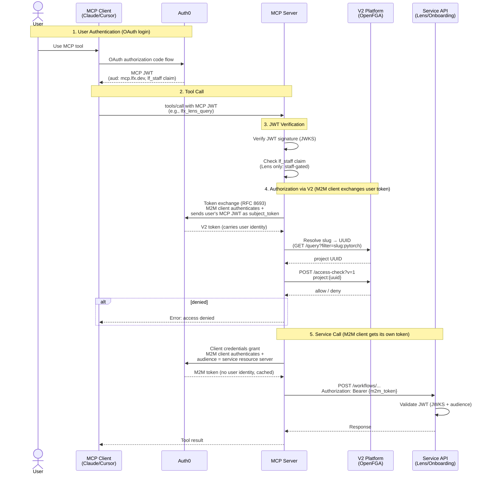
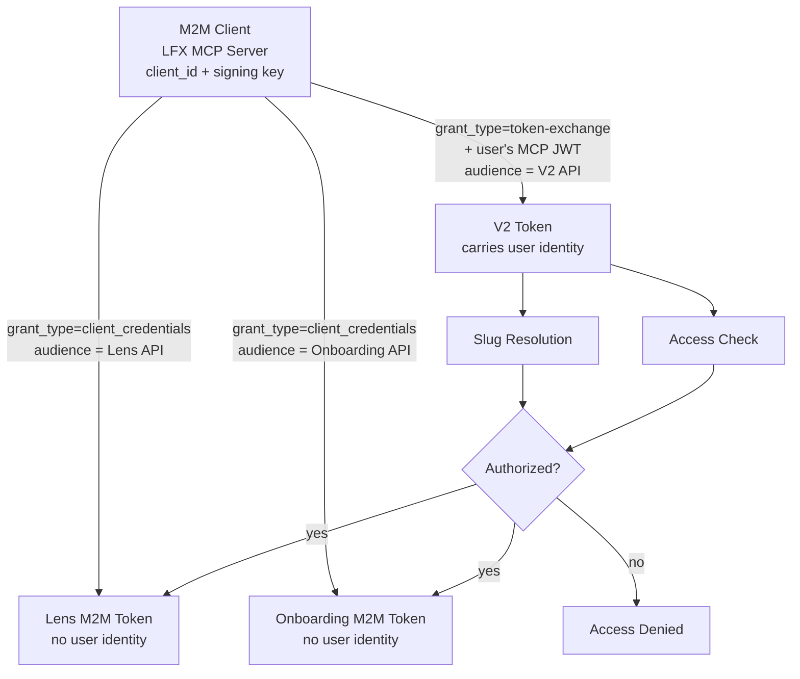

# Service API Architecture

> **Date:** 2026-03-24
> **Authors:** Joan Reyero, Josep Reyero

## Context

The LFX MCP Server exposes tools for **Member Onboarding** and **LFX Lens**. These are internal service APIs that have no per-user authorization. The MCP server authenticates to them using OAuth2 client credentials (M2M bearer tokens) issued by Auth0, with each service protected by its own Auth0 resource server.

The MCP server acts as the authorization gateway: before proxying a request to a service API, it calls the **V2 access-check endpoint** (backed by OpenFGA) to verify the user has the right relationship to the project.

### Access Rules

| Service | Required V2 Relation | Rationale |
|---------|---------------------|-----------|
| **Member Onboarding** | `writer` | Managing onboarding workflows is a write-level project operation |
| **LFX Lens** | `auditor` | Analytics/reporting requires auditor-level read access |

LFX Lens additionally requires the `lf_staff` JWT claim (staff-only tool).

---

## Three Tokens

All three tokens are issued by Auth0. The MCP server's M2M client (`LFX MCP Server`) authenticates to Auth0 for both the token exchange and client credentials grants — same client, different grant types.

| Token | Type | Purpose | Grant type | User identity? |
|-------|------|---------|-----------|----------------|
| MCP JWT | User | Authenticates the human user | Authorization code (OAuth login) | Yes |
| V2 Token | User-delegated | Slug resolution + access-check | Token exchange (RFC 8693): M2M client credentials + user's MCP JWT | Yes (delegated) |
| Service Token | Machine (M2M) | Authenticates MCP server to Lens/Onboarding | Client credentials: M2M client credentials only | No — pure machine |

---

## Authorization Flow



---

## M2M Client Usage

The same M2M client (`LFX MCP Server`) authenticates to Auth0 for both grant types. The difference is what it asks for:



---

## Access-Check API

Per Eric Searcy's clarification, the correct format uses `#` for the relation (not `:` as in the current Swagger docs).

```http
POST /access-check?v=1
Authorization: Bearer <v2-token>
Content-Type: application/json

{
  "requests": ["project:{uuid}#writer"]
}
```

```json
{
  "results": ["allow"]
}
```

Multiple checks can be batched — results are returned in the same order as requests.

---

## Slug-to-UUID Resolution

Users provide project **slugs** (e.g., `pytorch`). The access-check endpoint requires **UUIDs**. The MCP server resolves this using the user's exchanged V2 token.

Results are cached in-memory (slug→UUID mappings are stable).

---

## Tools

### LFX Lens

All tools require the `lf_staff` JWT claim and `auditor` relation to the project.

| MCP Tool | Backend Endpoint | Method | Description |
|----------|-----------------|--------|-------------|
| `lfx_lens_query` | `/workflows/lfx-lens-mcp-workflow/runs` | `POST` | Query LFX Lens analytics for a project. Accepts a natural language question and returns an analytics summary. |

#### LFX Lens API

`POST /workflows/lfx-lens-mcp-workflow/runs` accepts `multipart/form-data`:

| Field | Type | Required | Description |
|-------|------|----------|-------------|
| `message` | string | Yes | The user's natural language question |
| `additional_data` | JSON string | Yes | `{"foundation": {"slug": "<foundation_slug>"}}` |
| `stream` | string | No | `"false"` (default) or `"true"` |

Response:
```json
{
  "content": "CNCF currently has 726 active members\n\n| CURRENT_MEMBER_COUNT |\n| --- |\n| 726 |",
  "content_type": "str",
  "status": "COMPLETED"
}
```

### Member Onboarding

All tools require `writer` relation to the project.

The onboarding service exposes two sets of endpoints:

- **Custom REST endpoints** under `/member-onboarding/` — for memberships and agent configs.
- **AgentOS framework endpoints** under `/agents/{agent_id}/runs` — for running AI agents.

| MCP Tool | Backend Endpoint | Method | Description |
|----------|-----------------|--------|-------------|
| `onboarding_list_memberships` | `/member-onboarding/{slug}/memberships` | `GET` | List memberships for a project with per-agent action/todo counts. Accepts `status` filter (`all`, `pending`, `in_progress`, `closed`). |
| `onboarding_get_membership` | `/member-onboarding/{slug}/memberships/{id}` | `GET` | Get a single membership with full agent details. |
| `onboarding_run_agent` | `/agents/{agent_id}/runs` | `POST` | Run a specific onboarding agent for a membership. Supports a `preview` flag to dry-run the agent without executing side effects. |

#### Agent IDs

| Agent ID | Description |
|----------|-------------|
| `member-onboarding-slack` | Adds members to Slack channels |
| `member-onboarding-email` | Sends onboarding emails based on templates |
| `member-onboarding-discord` | Assigns Discord roles to members |
| `member-onboarding-github` | Creates PRs / file changes in GitHub repos |
| `member-onboarding-committees` | Adds members to LFX committees |
| `member-onboarding-hubspot-workflow` | Enrolls contacts in HubSpot workflows |

#### AgentOS Run Endpoint

`POST /agents/{agent_id}/runs` accepts `multipart/form-data`:

| Field | Type | Required | Description |
|-------|------|----------|-------------|
| `message` | string | Yes | Text input describing what the agent should do |
| `stream` | boolean | No | Enable streaming via Server-Sent Events |
| `session_id` | string | No | Session ID for context continuity |
| `user_id` | string | No | User context identifier |

The `preview` flag is handled at the MCP tool level by routing to the `member-onboarding-preview` agent ID instead of the requested agent. This returns predicted actions and prerequisite status without executing side effects.

---

## Tool Naming Convention

Tools follow a `<domain>_<verb>_<resource>` pattern:

- **V2 tools** (no prefix needed — they're the primary domain): `search_projects`, `get_committee`, `create_committee_member`
- **Service tools** (prefixed with service name for disambiguation): `onboarding_list_memberships`, `onboarding_run_agent`, `lfx_lens_query`

Verbs are consistent with the V2 tools: `search`, `get`, `list`, `create`, `update`, `delete`, `run`, `query`.

---

## Auth0 Resource Servers

| Resource Server | Audience | Used By | Scopes |
|----------------|----------|---------|--------|
| LFX MCP API | `mcp.lfx.dev/mcp` | Claude, Cursor, Inspector | `read:all`, `manage:all` |
| LFX V2 API | `lfx-api.v2.cluster.lfx.dev/` | MCP server (token exchange) | `access:api` |
| LFX Lens API | configured via `LFXMCP_LENS_API_AUDIENCE` | MCP server (client credentials) | `access:api` |
| Member Onboarding API | configured via `LFXMCP_ONBOARDING_API_AUDIENCE` | MCP server (client credentials) | `access:api` |

---

## Configuration

### Environment Variables

| Variable | Description |
|----------|-------------|
| `LFXMCP_ONBOARDING_API_URL` | Base URL of the member onboarding service |
| `LFXMCP_ONBOARDING_API_AUDIENCE` | Auth0 resource server audience for the member onboarding API |
| `LFXMCP_LENS_API_URL` | Base URL of the LFX Lens service |
| `LFXMCP_LENS_API_AUDIENCE` | Auth0 resource server audience for the LFX Lens API |

Existing M2M credentials (`LFXMCP_CLIENT_ID`, `LFXMCP_CLIENT_SECRET` or `LFXMCP_CLIENT_ASSERTION_SIGNING_KEY`, `LFXMCP_TOKEN_ENDPOINT`) are reused for both token exchange (V2 access-check) and client credentials grants (service API authentication).

---

## Current Status

The auth infrastructure is complete but the service API calls are **stubbed with dummy responses**. This is because:

1. The Auth0 resource servers for Lens and Onboarding need to be created first (via `auth0-terraform`)
2. The service APIs need to be updated to validate Auth0 JWTs instead of API keys
3. Once both are deployed, the dummy responses will be replaced with actual API calls
